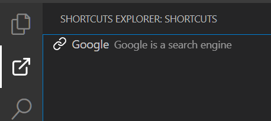

# Project Shortcuts

Easily store shortcuts related to your project and access them directly from VSCode.

Juste create a **shortcuts.json** in your root folder with this content:

    [
        {
            "name": "Google",
            "description": "Google is a search engine",
            "url": "http://www.google.com"
        }
    ]

Then access your shortcuts directly in the activity bar.

---

[External link icons created by ChepyF - Flaticon](https://www.flaticon.com/free-icons/external-link)